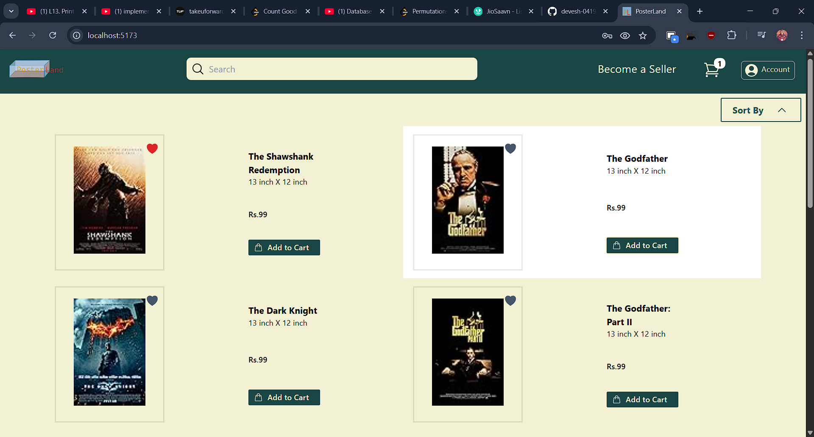
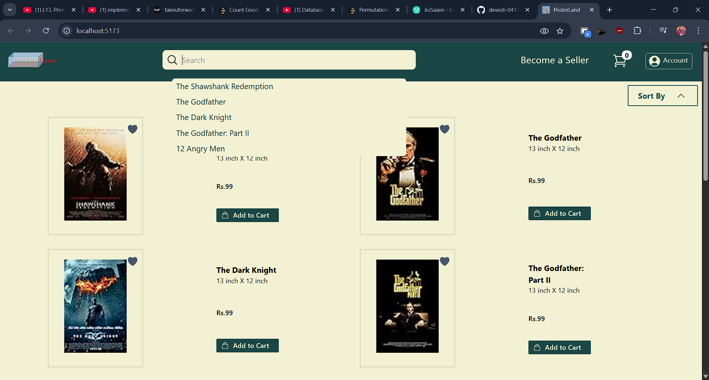
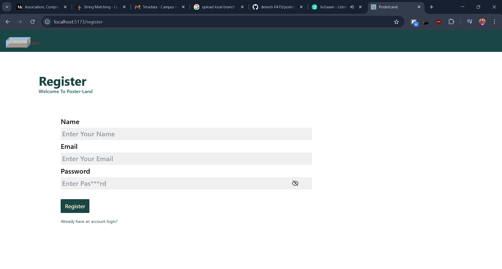
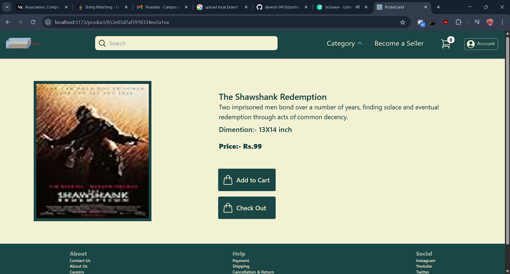
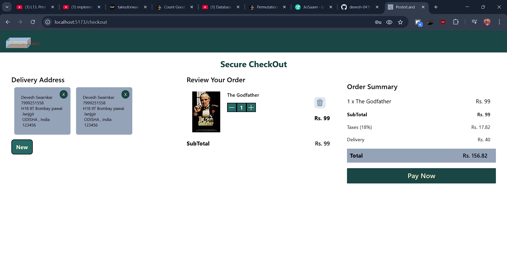

 

# PosterSell

PosterSell is a web application for browsing, purchasing, and managing posters. The project is structured using React, modern JavaScript, and follows a clean, modular architecture for scalability and maintainability.

## Table of Contents

- [Features](#features)
- [Project Structure](#project-structure)
- [Getting Started](#getting-started)
- [Available Scripts](#available-scripts)
- [UI](#ui)


## Features

- User authentication and profile management
- Poster product listing and details
- Shopping cart and checkout flow
- Responsive and modern UI
- Server communication for dynamic data handling


## Project Structure

```
src/
│
├── app/              # App-level configuration
├── assets/           # Static images, icons, etc
├── components/       # Reusable UI components
│   ├── auth/         # Authentication (login, registration)
│   ├── checkOut/     # Checkout workflow
│   ├── footer/       # Footer component
│   ├── home/         # Homepage
│   ├── navBar/       # Navigation bar
│   ├── product/      # Product listing/details
│   └── profile/      # User profile UI
├── serverCalls/      # API/service logic
├── App.jsx           # Root React component
├── App.css           # Global styling
├── index.css         # Main stylesheet
├── main.jsx          # App entry point (usually for React 18+ setup)
└── ...
```


## Getting Started

### Prerequisites

- Node.js (v18 or later recommended)
- npm or yarn


### Installation

1. **Clone the repository**

```bash
git clone https://github.com/yourusername/postersell.git
cd postersell
```

2. **Install dependencies**

```bash
npm install
# or
yarn install
```

3. **Start the development server**

```bash
npm start
# or
yarn start
```

4. Visit `http://localhost:5173` in your browser.

## Available Scripts

- `npm start` — Runs the app in development mode.
- `npm run dev` — Builds the app for production.
- `npm run lint` — Runs eslint for code quality (if configured).


## UI

### Home Page
#### Favourites
 

#### Search
 

### Auth Page
#### Registration
 

### Product Detail Page

#### Registration
 

### Cart Page

#### Checkout
 


## Contributing

Contributions are welcome! Please submit a pull request or open an issue to discuss your suggestions.


<div style="text-align: center">⁂</div>